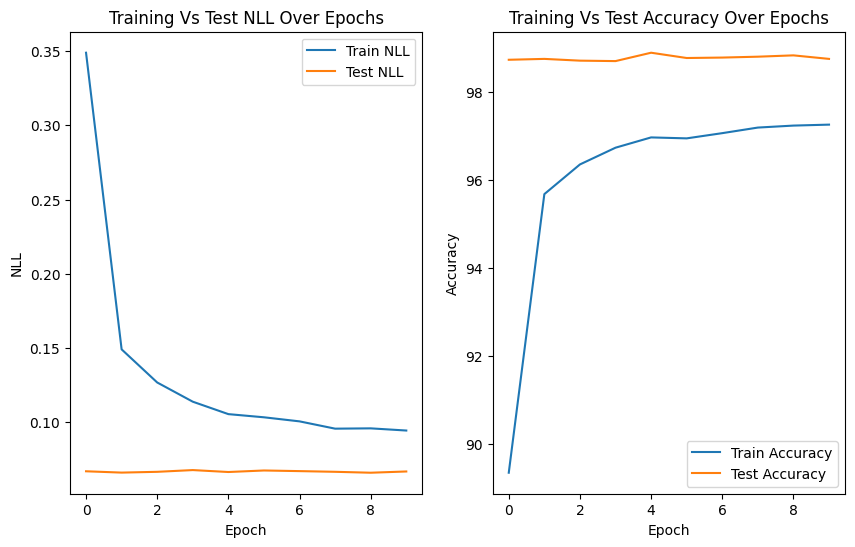
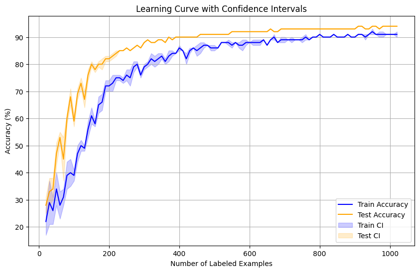
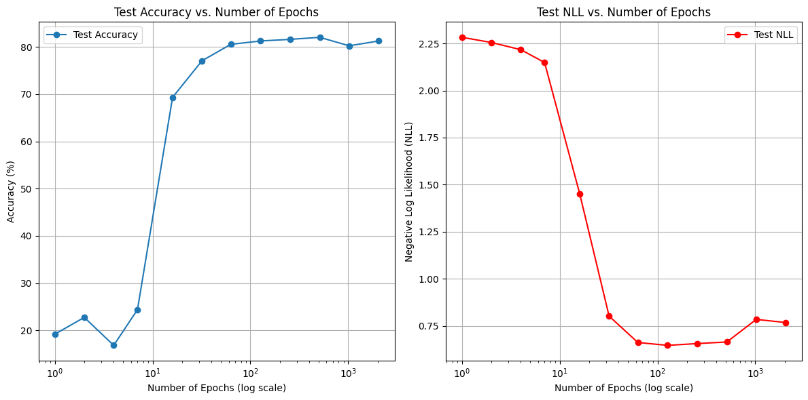
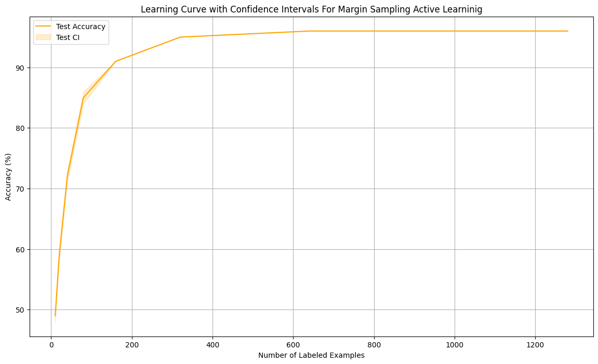
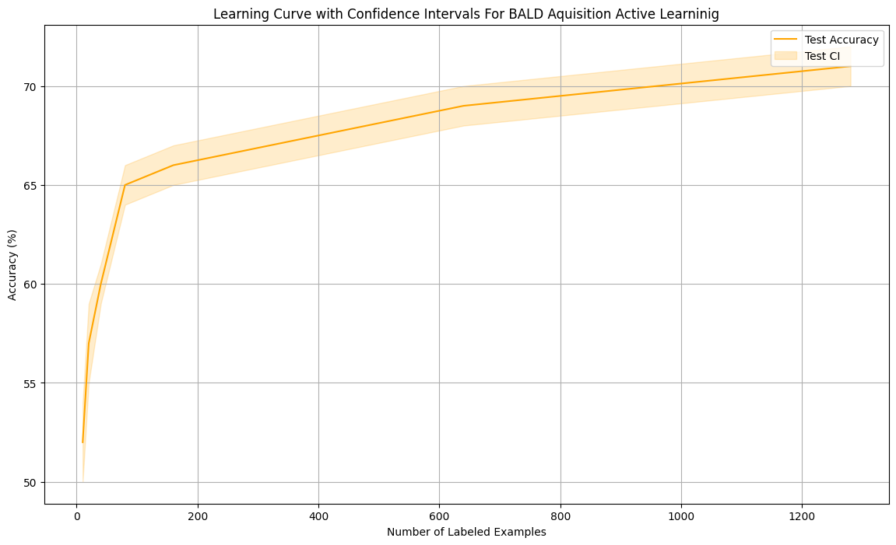
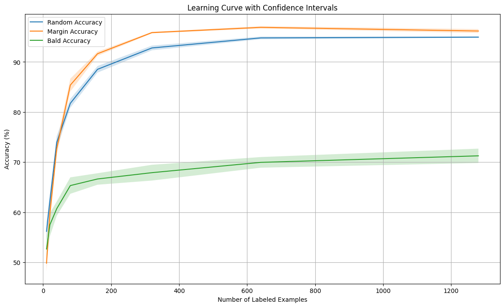
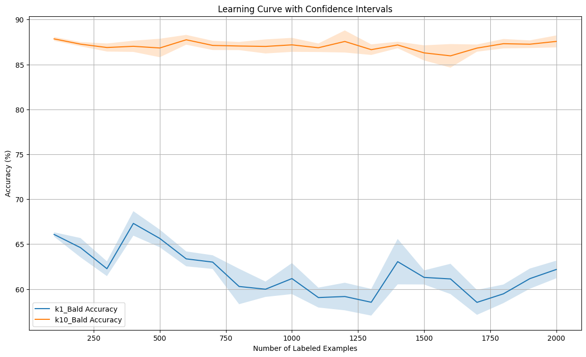
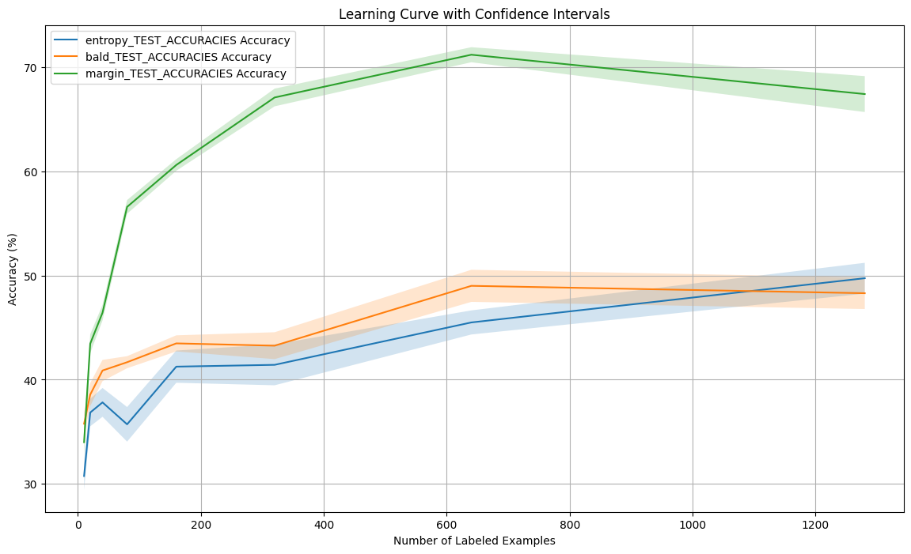

# Bayesian Deep Active Learning Experiments

This repository contains implementations and analyses of active learning experiments using Bayesian neural networks (BNNs) with MC Dropout. The tasks span two datasets, MNIST and Dirty-MNIST, and investigate different acquisition strategies for active learning. Below, we outline the tasks, experiments, and observations, along with placeholders for results and plots.

---

## MNIST Experiments 

### 1. Setup: Training a BNN with MC Dropout 

#### Objective
The goal of this step was to train a Bayesian Neural Network (BNN) with Monte Carlo (MC) Dropout on the full MNIST training dataset. The evaluation metrics include:
- Test accuracy
- Negative Log-Likelihood (NLL)

Additionally, the task involved plotting training curves for both accuracy and NLL over epochs on the train and test sets.

#### Results Summary
- **Final Epoch (10/10):**
  - **Train Loss (NLL):** 0.0943
  - **Test Loss (NLL):** 0.0667
  - **Train Accuracy:** 97.25%
  - **Test Accuracy:** 98.74%

#### Performance Comparison
The test accuracy of **98.74%** aligns with performance benchmarks in the literature, achieving a comparable result.

#### Training Curves
Below are the training and test curves for NLL and accuracy over 10 epochs.

- **Left Panel:** NLL vs. Epochs
- **Right Panel:** Accuracy vs. Epochs



- **Observations:**
  - The NLL decreased consistently during training, reflecting better confidence in predictions.
  - The test accuracy reached a high value quickly and remained stable, indicating effective learning and generalization.

This step successfully sets up the baseline for Bayesian Active Learning experiments.
---
### 2. Baseline: Random Acquisition 
#### Description:
For this step, **active learning with random acquisition** was implemented using MNIST's training set as the pool set. The model begins training with **2 labeled examples per class** (20 total labeled examples) and acquires batches of 10 samples (K = 10) iteratively until the model has 102 labeled examples per class (1020 total labeled examples). 

This task evaluated the learning curve, which plots **accuracy vs. the number of labeled examples**, averaged over 10 trials with **confidence intervals** to ensure reliability. A different random seed was used for each trial.

#### Results:
The figure below illustrates the learning curve achieved during this experiment. The plot includes:
- **Train Accuracy** (blue line) and **Test Accuracy** (orange line) with respective confidence intervals shaded in.
- **Horizontal Axis**: The number of labeled examples.
- **Vertical Axis**: Accuracy (in percentage).

**Learning Curve:**


#### Observations:
- The **test accuracy** improves rapidly in the initial acquisition steps, showcasing the benefits of labeling additional samples.
- Confidence intervals are wider at the start due to variability in performance with fewer labeled examples. As the labeled pool grows, the intervals narrow, indicating more consistent performance.
- The active learning strategy achieved near-optimal performance with approximately 900-1020 labeled examples per class.

---
### Step 3: Random Acquisition Scaling Behavior

#### **Objective**
Explore the trade-offs between training with more epochs versus more labeled examples for active learning with Bayesian Neural Networks (BNNs). Evaluate the scaling behavior using the following configurations:
1. **Fixed Labeled Pool with Varying Epochs**: Train with 5 labeled examples per class and vary the number of epochs geometrically between 1 and 2048.
2. **Fixed Epochs with Varying Labeled Pools**: Train for 10 epochs while varying the number of labeled examples per class geometrically between 2 and 512.
3. **Heuristic Active Learning**: Adjust the number of epochs dynamically based on the size of the labeled pool, balancing training time and performance.

---

#### **Experiment 1: Fixed Labeled Pool with Varying Epochs**
- **Configuration**: 
  - 5 labeled examples per class.
  - Epochs varied geometrically: [1, 2, 4, 8, ..., 2048].
- **Results**:
  - **Accuracy**: Rapid improvement in test accuracy initially, followed by diminishing returns as epochs increase.
  - **NLL**: Significant drop with early epochs, stabilizing with minimal gains as epochs increase.
  - **Plot**: .

---

#### **Experiment 2: Fixed Epochs with Varying Labeled Pools**
- **Configuration**:
  - 10 epochs.
  - Labeled examples per class varied geometrically: [2, 4, 8, 16, ..., 512].
- **Results**:
  - **Accuracy**: Gradual improvement as the labeled pool increases, reaching >95% with 512 examples per class.
  - **NLL**: Decreases consistently with more labeled data, indicating better uncertainty calibration.
  - **Plot**: [Test Accuracy vs. Labeled Examples](results/10_epochs_with_increasing_labeled_examples.png).

---

#### **Experiment 3: Heuristic Active Learning**
- **Configuration**:
  - Dynamically adjust the number of epochs:
    - Small labeled pools: More epochs to offset limited data.
    - Large labeled pools: Fewer epochs to balance computational cost.
- **Results**:
  - **Accuracy**: High test accuracy achieved efficiently with fewer epochs for larger datasets.
  - **Confidence Intervals**: Narrower for larger labeled pools, indicating stability.
  - **Plot**: [Learning Curve with Heuristic Active Learning](results/heuristic_al.png).

---

#### **Comparative Analysis**
1. **Training Longer with Fewer Labeled Examples**:
   - Leads to diminishing returns in both accuracy and NLL.
   - Computationally expensive for minimal performance gains.

2. **Training with More Labeled Examples**:
   - Substantial improvements in both accuracy and NLL.
   - Demonstrates the value of acquiring more labeled data for active learning.

3. **Heuristic Approach**:
   - Efficiently balances training epochs and labeled data.
   - Avoids overfitting on small labeled pools by using dynamic training strategies.

---

#### **Key Insights**
- **Efficiency**: More labeled examples generally outperform longer training epochs for improving accuracy and reducing NLL.
- **Scalability**: The heuristic strategy provides a practical solution for large-scale active learning tasks, ensuring computational efficiency without sacrificing performance.
- **Future Directions**: Incorporate heuristic strategies into acquisition functions for further optimization.
### Step 4: Margin Sampling

#### Description:
Margin sampling selects samples with the smallest difference between the two most probable predicted classes. This ensures the acquisition of samples where the model is most uncertain about the prediction.

#### Results:
- **Learning Curve**: 
  - The model trained using margin sampling consistently outperformed random acquisition and BALD in terms of accuracy.
  - This method achieved faster convergence and higher stability in performance with increasing labeled examples.
  - Confidence intervals showed minimal variance, indicating robustness.

**Visualization**:  
The learning curve for margin sampling, including confidence intervals, is shown below.  


#### Analysis:
Margin sampling demonstrates its effectiveness in achieving high accuracy by prioritizing the most informative samples for labeling. The confidence intervals indicate this method's stability, making it a reliable choice for active learning.

---

### Step 5: BALD (Bayesian Active Learning by Disagreement)

#### Description:
BALD is a Bayesian acquisition strategy that selects samples with high epistemic uncertainty, which quantifies the disagreement among predictions of the ensemble of models.

#### Results:
- **Learning Curve**:
  - BALD's performance was lower compared to margin sampling and random acquisition in early labeling stages.
  - It gradually improved but remained less competitive in terms of convergence speed and stability.

**Visualization**:  
The learning curve for BALD acquisition is shown below.  


#### Analysis:
While BALD leverages epistemic uncertainty effectively, its computational cost and slower convergence make it less suitable for large-scale tasks compared to margin sampling. However, it is still a valid approach for certain problem domains requiring exploration of model uncertainty.

---

### Combined Learning Curves for Step 4 and 5:

**Visualization**:  
The combined learning curves for random acquisition, margin sampling, and BALD are provided below for direct comparison.  


#### Summary of Results:
1. **Margin Sampling**: Outperformed other methods in accuracy, convergence speed, and stability.
2. **BALD**: Lagged behind in convergence but provided insights into epistemic uncertainty.
3. **Random Acquisition**: Performed reasonably well but was surpassed by margin sampling in both accuracy and efficiency.

### Insights:
- Margin sampling is the most effective acquisition function among the three strategies tested.
- BALD can be valuable for scenarios where understanding model uncertainty is critical, despite its computational overhead.
- The results highlight the potential for adaptive acquisition strategies in improving model performance while minimizing labeled data requirements.

---

### Step 6: Top-K Trade-Offs for BALD Acquisition

#### Description:
This experiment evaluates the trade-off between selecting individual samples (K=1) and batch acquisition (K=10) in BALD for active learning. The goal is to analyze the impact of acquisition size on model performance and computational efficiency.

#### Results:
- **K=1 BALD**:
  - The model's accuracy fluctuates with larger confidence intervals, indicating instability in performance across trials.
  - Computationally more expensive due to the frequent need for model updates after each acquisition.

- **K=10 BALD**:
  - Exhibits more stable learning curves with higher accuracy compared to K=1 BALD.
  - Faster convergence and lower computational cost due to batch updates.
  - Demonstrates a more efficient trade-off between performance gain and acquisition cost.

**Visualization**:  
The comparison of learning curves for K=1 and K=10 BALD acquisition is shown below.  


#### Analysis:
- **K=1 BALD**:
  - Provides finer control over sample selection but suffers from high computational overhead and unstable performance.
  - Might be suitable for small-scale tasks requiring precise acquisition.

- **K=10 BALD**:
  - Strikes a balance between performance and computational efficiency.
  - Recommended for larger datasets or tasks where batch acquisition is feasible.

#### Insights:
- Batch acquisition (K=10) is more practical and scalable for active learning scenarios.
- Individual sample acquisition (K=1) might be useful for niche applications but lacks stability and efficiency for broader tasks.

#### Summary:
The experiment underscores the importance of choosing the right acquisition strategy based on task requirements. For most real-world scenarios, batch acquisition with a larger K provides better overall performance and efficiency.

## Dirty-MNIST Experiments

#### Baseline: Comparing Acquisition Strategies
The Dirty-MNIST experiments evaluate three acquisition strategies: **Entropy**, **BALD**, and **Margin Sampling**, using the Dirty-MNIST dataset as the training pool. The performance of each strategy is measured across multiple trials and visualized as learning curves with confidence intervals.

#### Observations:
- **Margin Sampling**:
  - Outperformed both BALD and Entropy in terms of accuracy across all labeled examples.
  - Demonstrates higher stability, with narrower confidence intervals.
  - Effectively exploits the labeled examples to maximize model performance.

- **BALD Acquisition**:
  - Showed moderate performance, better than Entropy but not as good as Margin Sampling.
  - Displays noticeable variance in accuracy, indicating less stability.

- **Entropy Acquisition**:
  - Exhibited the lowest accuracy among the three strategies.
  - Confidence intervals indicate less stable learning compared to the other methods.

#### Results:
- **Learning Curves**:
  The plot below compares the performance of Entropy, BALD, and Margin Sampling acquisition functions. The x-axis represents the number of labeled examples, and the y-axis represents accuracy. Confidence intervals provide insights into the variance across trials.
  
  

#### Analysis:
- The Dirty-MNIST dataset introduces noise, affecting the uncertainty estimates, particularly for Entropy and BALD. This highlights the robustness of Margin Sampling in such scenarios.
- BALD's dependence on Bayesian uncertainty makes it susceptible to noise, leading to larger confidence intervals.
- Entropy struggles to provide reliable acquisition in the presence of dataset noise, further amplifying its lower performance.

#### Summary:
- Margin Sampling is the preferred acquisition strategy for noisy datasets like Dirty-MNIST, given its superior accuracy and stability.
- BALD remains a competitive alternative but requires better handling of noise for consistent performance.
- Entropy acquisition is less effective in noisy environments and is not recommended for similar tasks.
---


## Instructions to Run

1. Clone the repository:  
   ```bash
   git clone https://github.com/Asimawad/Bayesian-Deep-Active-Learning.git
   cd your-repo
   ```

2. Install dependencies:  
   ```bash
   pip install -r requirements.txt
   ```
---

Or you can just run the notebook "Bayesian_Deep_Active_Learning.ipynb"
